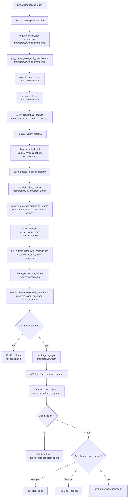
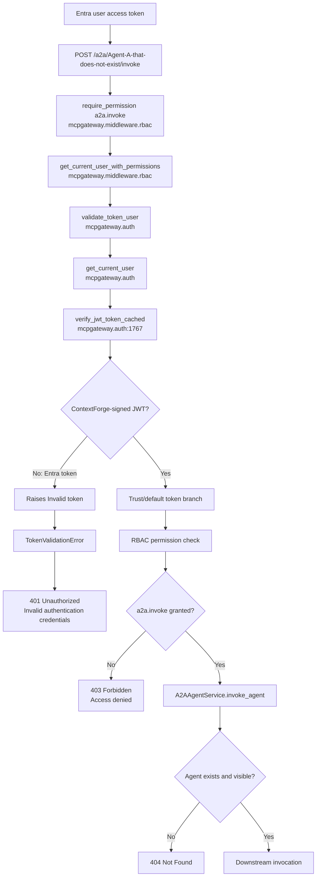

# Entra A2A Barrier Test

## Goal

Demonstrate the current blocker for the proposed JWT-trust implementation:

```text
Microsoft Entra end-user access token
  -> POST /a2a/<nonexistent-agent>/invoke
  -> ContextForge returns 401 before external-token verification,
     group mapping, RBAC, or agent lookup.
```

The deliberately nonexistent agent is intentional. A corrected implementation with an authorized user would reach agent lookup and return `404`, because the agent does not exist. This test is successful when it establishes why the current implementation instead returns `401`.

## Scope

- Use the stack tip in PR #6755, not `main`.
- Use only an Entra end-user token for the tested request.
- Do not use an admin token, create providers, create group mappings, or create an agent.
- Do not print, commit, upload, or share either token.

## Token Files

The test reads these existing untracked files without printing their contents:

```text
entra-token-valid.txt  Real Entra user access token
entra-token-fake.txt   Deliberately invalid token
```

## Checkout

Fetch and switch to the complete proposed implementation stack:

```bash
git fetch origin pull/6755/head:review/trust-mode-6755
git switch review/trust-mode-6755
git log -1 --oneline
```

The expected stack-tip commit is `1994d6125`, titled `docs(auth): document JWT-trust mode and complete validation gate`.


## Prove the Exact Barrier

This optional temporary marker proves the exact function reached at runtime. Add this line immediately before the `payload = ...` line in `mcpgateway/auth.py`:

```python
logger.error("AUTH_DIAGNOSTIC: get_current_user is invoking verify_jwt_token_cached for request path %s", request.url.path if request else "<none>")
```

The surrounding code must look like this:

```python
logger.debug("Attempting JWT token validation")
logger.error("AUTH_DIAGNOSTIC: get_current_user is invoking verify_jwt_token_cached for request path %s", request.url.path if request else "<none>")
payload = await verify_jwt_token_cached(credentials.credentials, request)
logger.debug("JWT token validated successfully")
```


## Run the Test

Open **Terminal 1** in the repository root. The following command starts an isolated gateway on port `8011`. It uses a disposable SQLite database under `/tmp/opencode`.

```bash
AUTH_REQUIRED=true \
MCPGATEWAY_A2A_ENABLED=true \
JWT_TRUST_MODE=jwt-trust \
SSO_API_TOKEN_AUTH_ENABLED=true \
DEV_MODE=true \
DATABASE_URL='sqlite:////tmp/opencode/entra-a2a-barrier.db' \
JWT_SECRET_KEY='local-test-jwt-secret-key-which-is-longer-than-thirty-two-characters' \
AUTH_ENCRYPTION_SECRET='local-test-encryption-secret-which-is-longer-than-thirty-two-chars' \
BASIC_AUTH_PASSWORD='Local-test-basic-password-123!' \
PLATFORM_ADMIN_PASSWORD='Local-test-platform-password-123!' \
DEFAULT_USER_PASSWORD='Local-test-default-password-123!' \
.venv/bin/uvicorn mcpgateway.main:app --host 127.0.0.1 --port 8011
```

Open **Terminal 2** in the repository root and confirm the gateway is available:

```bash
curl -s http://127.0.0.1:8011/health
```

Submit the fake-token control. It must return `401`:

```bash
curl -i -X POST http://127.0.0.1:8011/a2a/Agent-A-that-does-not-exist/invoke \
  -H "Authorization: Bearer $(tr -d '\r\n' < entra-token-fake.txt)" \
  -H 'Content-Type: application/json' \
  -d '{"parameters":{},"interaction_type":"query"}'
```

Submit the real Entra token:

```bash
curl -i -X POST http://127.0.0.1:8011/a2a/Agent-A-that-does-not-exist/invoke \
  -H "Authorization: Bearer $(tr -d '\r\n' < entra-token-valid.txt)" \
  -H 'Content-Type: application/json' \
  -d '{"parameters":{},"interaction_type":"query"}'
```

Both currently return:

```text
HTTP/1.1 401 Unauthorized
{"detail":"Invalid authentication credentials"}
```

And terminal 1 will show this marker followed by the authentication error:

```text
AUTH_DIAGNOSTIC: get_current_user is invoking verify_jwt_token_cached for request path /a2a/Agent-A-that-does-not-exist/invoke
Authentication failed: TokenValidationError: Invalid token
```

The existing post-call line, `JWT token validated successfully`, is not printed. This proves that `verify_jwt_token_cached()` raises before the trust-mode branch can execute. Remove the temporary `AUTH_DIAGNOSTIC` line after the test.


## Result Interpretation

| Response | Meaning |
|---|---|
| `401` for valid and fake tokens | Blocker. The A2A dependency invokes ContextForge's internal-only verifier, so it does not dispatch the valid Entra token to the external JWKS verifier. The valid Entra token is rejected before group mapping, RBAC, visibility, or agent lookup. |
| `403` for the valid token | External authentication advanced, but Layer-2 authorization denied `a2a.invoke`. This is also an identified implementation blocker: mapped claims-derived roles are not forwarded into the real RBAC decorator. |
| `404` for the valid token | The test advanced through authentication and authorization to A2A agent lookup. This is the desired result for the intentionally nonexistent agent. It would mean the authentication ingress blocker has been fixed. |
| `200` | Unexpected for this test because the requested agent name is deliberately nonexistent. Verify the URL and routing. |

## Why a Valid Token Currently Looks Like a Fake Token

The real A2A request path is:

```text
POST /a2a/{agent_name}/invoke
  -> @require_permission("a2a.invoke")
  -> get_current_user_with_permissions()
  -> validate_token_user()
  -> get_current_user()
  -> verify_jwt_token_cached()
```

At stack tip #6755, `mcpgateway/auth.py:1767` calls:

```python
payload = await verify_jwt_token_cached(credentials.credentials, request)
```

That verifier accepts ContextForge-signed JWTs only. The external Entra issuer/JWKS path is in `verify_credentials_cached()` in `mcpgateway/utils/verify_credentials.py`, but the A2A authentication dependency does not call it.

Therefore the test's expected `401` is evidence of an implementation wiring failure, not evidence that the Entra token is invalid.

## Intended Entra Token Journey



The intended `404` for this smoke test is `Y`: authentication and `a2a.invoke` authorization passed, but the deliberately nonexistent agent was not found.

## Current Observed Journey



The observed valid-token request followed the `A -> ... -> K` path. The temporary runtime marker confirmed entry to `verify_jwt_token_cached`, and the absence of the post-call success log confirmed that it raised before the trust branch.

## HTTP Barrier Reference

| Barrier | Function or layer | Meaning for this test |
|---|---|---|
| `401 Unauthorized` | `get_current_user()` -> `verify_jwt_token_cached()` | Token is rejected before external Entra verification, group mapping, RBAC, and agent lookup. This is the currently observed result. |
| `403 Forbidden` | `require_permission("a2a.invoke")` -> `check_permission_inline()` -> `PermissionService.check_permission()` | Authentication passed, but the user lacks the effective invocation permission. For the proposed stack, this can happen because claims-derived roles are not passed into the real decorator path. |
| `404 Not Found` | `A2AAgentService.invoke_agent()` -> `_check_agent_access()` or agent lookup | The request reached A2A. It either lacks visibility to a team-scoped agent, or the requested agent does not exist. For the deliberately nonexistent agent and an authorized caller, this is the expected success condition. |
| `400 Bad Request` | `A2AAgentService.invoke_agent()` | The agent was resolved but is disabled, or an A2A request/downstream error occurred. |

